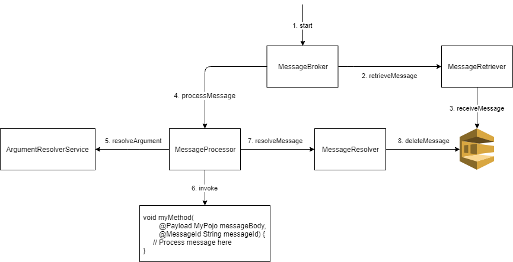

# Java Dynamic SQS Listener
[](https://travis-ci.org/JaidenAshmore/java-dynamic-sqs-listener)
[](https://coveralls.io/github/JaidenAshmore/java-dynamic-sqs-listener?branch=master)
[](https://lgtm.com/projects/g/JaidenAshmore/java-dynamic-sqs-listener/alerts/)
[](https://lgtm.com/projects/g/JaidenAshmore/java-dynamic-sqs-listener/context:java)
[](https://search.maven.org/search?q=g:%22com.jashmore%22%20AND%20%22java-dynamic-sqs-listener%22)

The Java Dynamic SQS Listener is a library that simplifies the listening of messages on an [AWS SQS queue](https://aws.amazon.com/sqs/).  It has been
built from the ground up with the goal of making it easily customisable, allowing each component of the library to be easily interchanged if desired.
The library has also been implemented to allow for it to change dynamically during runtime, for example the amount of messages being processed concurrently
can be changed via a feature flag or other configuration properties.

To keep the README minimal and easy to digest, the rest of the documentation is kept in the [doc](./doc/documentation.md) folder which provides a more
thorough overview of how to use the library.

## Core Infrastructure
This library has been divided into four main components each with distinct responsibilities. The following is a diagram describing a simple flow of a
single SQS message flowing through each of the components to eventually execute on the consumer's method that can process this message.



Details about each component is:
- The [MessageRetriever](./java-dynamic-sqs-listener-api/src/main/java/com/jashmore/sqs/retriever/MessageRetriever.java) handles
obtaining messages from the SQS queue. This can optimise the retrieval of messages by batching requests for messages or prefetching messages before
they are needed.
- The [MessageProcessor](./java-dynamic-sqs-listener-api/src/main/java/com/jashmore/sqs/processor/MessageProcessor.java) controls
the processing of a message from the queue by delegating it to the corresponding Java method that handles the message.
- The [ArgumentResolverService](./java-dynamic-sqs-listener-api/src/main/java/com/jashmore/sqs/argument/ArgumentResolverService.java) is used by the 
[MessageProcessor](./java-dynamic-sqs-listener-api/src/main/java/com/jashmore/sqs/processor/MessageProcessor.java) to populate the
arguments of the method being executed from the message. For example, a parameter with the
[@Payload](./java-dynamic-sqs-listener-core/src/main/java/com/jashmore/sqs/argument/payload/Payload.java) annotation will be resolved with the
body of the message cast to that type (e.g. a POJO).
- The [MessageBroker](./java-dynamic-sqs-listener-api/src/main/java/com/jashmore/sqs/broker) is the main container that controls the whole flow
of messages from the [MessageRetriever](./java-dynamic-sqs-listener-api/src/main/java/com/jashmore/sqs/retriever/MessageRetriever.java) to the
[MessageProcessor](./java-dynamic-sqs-listener-api/src/main/java/com/jashmore/sqs/processor/MessageProcessor.java). It can determine when more messages
are to be processed and the rate of concurrency for processing messages.

See [Core Implementations Overview](./doc/core-implementations-overview.md) for more information about the core implementations provided by this library.

## Spring Quick Guide
The following provides some examples using the Spring Starter for this library. *Note that this library is not Spring specific as the main implementations are
kept in the [core module](./java-dynamic-sqs-listener-core) which is framework agnostic.*

### Using the Spring Starter
This guide will give a quick guide to getting started for Spring Boot using the Spring Stater.

Include the maven dependency in your Spring Boot pom.xml:
```xml
<dependency>
    <groupId>com.jashmore</groupId>
    <artifactId>java-dynamic-sqs-listener-spring-starter</artifactId>
    <version>${sqs.listener.version}</version>
</dependency>
```

In one of your beans, attach a
[@QueueListener](./java-dynamic-sqs-listener-spring/java-dynamic-sqs-listener-spring-starter/src/main/java/com/jashmore/sqs/spring/container/basic/QueueListener.java)
annotation to a method indicating that it should process messages from a queue.

```java
@Service
public class MyMessageListener {
    @QueueListener("${insert.queue.url.here}") // The queue here can point to your SQS server, e.g. a local SQS server or one on AWS 
    public void processMessage(@Payload final String payload) {
        // process the message payload here
    }
}
```

This will use any user configured `SqsAsyncClient` in the application context for connecting to the queue, otherwise if none is defined, a default
is provided that will look for AWS credentials/region from multiple areas, like the environment variables. See
[How to connect to AWS SQS Queues](./doc/how-to-guides/how-to-connect-to-aws-sqs-queue.md) for information about connecting to an actual queue.

### Setting up a queue listener that batches requests for messages
The [Spring Cloud AWS Messaging](https://github.com/spring-cloud/spring-cloud-aws/tree/master/spring-cloud-aws-messaging) `@SqsListener` works by requesting
a set of messages from the SQS and when they are done it will request some more. There is one disadvantage with this approach in that if 9/10 of the messages
finish in 10 milliseconds but one takes 10 seconds no other messages will be picked up until that last message is complete. The
[@BatchingQueueListener](./java-dynamic-sqs-listener-spring/java-dynamic-sqs-listener-spring-starter/src/main/java/com/jashmore/sqs/spring/container/batching/BatchingQueueListener.java)
provides the same basic functionality but it also provides a timeout where eventually it will request for more messages even for the threads that are
ready for another message. It will also batch the removal of messages from the queue and therefore with a concurrency level of 10, if there are a lot messages
 on the queue, only 2 requests would be made to SQS for retrieval and deletion of messages. The usage is something like this:

```java
@Service
public class MyMessageListener {
    @BatchingQueueListener(value = "${insert.queue.url.here}", concurrencyLevel = 10, maxPeriodBetweenBatchesInMs = 2000) 
    public void processMessage(@Payload final String payload) {
        // process the message payload here
    }
}
```

In this example above we have set it to process 10 messages at once and when there are threads wanting more messages it will wait for a maximum of 2 seconds
before requesting messages for threads waiting for another message.

### Setting up a queue listener that prefetches messages
The amount of messages for a service may be extremely high that prefetching messages may be a way to optimise the throughput of the application. The
[@PrefetchingQueueListener](./java-dynamic-sqs-listener-spring/java-dynamic-sqs-listener-spring-starter/src/main/java/com/jashmore/sqs/spring/container/prefetch/PrefetchingQueueListener.java)
annotation can be used to pretech messages in a background thread while messages are currently being processed.  The usage is something like this:

```java
@Service
public class MyMessageListener {
    @PrefetchingQueueListener(value = "${insert.queue.url.here}", concurrencyLevel = 10, desiredMinPrefetchedMessages = 5, maxPrefetchedMessages = 10) 
    public void processMessage(@Payload final String payload) {
        // process the message payload here
    }
}
```

In this example, if the amount of prefetched messages is below the desired amount of prefetched messages it will try and get as many messages as possible
maximum.

*Note: because of the limit of the number of messages that can be obtained from SQS at once (10), having the maxPrefetchedMessages more than
10 above the desiredMinPrefetchedMessages will not provide much value as once it has prefetched more than the desired prefeteched messages it will
not prefetch anymore.*

### Using custom library components in queue listener annotation
The [CustomQueueListener](./java-dynamic-sqs-listener-spring/java-dynamic-sqs-listener-spring-starter/src/main/java/com/jashmore/sqs/spring/container/custom/CustomQueueListener.java)
is provided to allow for consumers to create queue listeners with their own implementations of the library components via factory beans. This is not
the most intuitive way to set up a queue listener as building all of these factories are a bit of pain and it would probably be easier to just define
your own annotation, see [Building a new queue listener annotation](#building-a-new-queue-listener-annotation) below for how to do this.  Regardless, the
steps to easily set up a custom Queue Listener is:

1. Define factories that can construct all of the components of the library needed for this queue listener. The easiest way is to use lambdas but actual
implementations of the factory is appropriate too. See that each factory will build the main components of the library.
    ```java
    @Configuration
    public class MyConfig {
        @Bean
        public MessageRetrieverFactory myMessageRetrieverFactory(final SqsAsyncClient sqsAsyncClient) {
            return (queueProperties) -> new MyCustomMessageRetriever(queueProperties);
        }

        @Bean
        public MessageProcessorFactory myMessageProcessorFactory(final ArgumentResolverService argumentResolverService,
                                                                 final SqsAsyncClient sqsAsyncClient) {
            // In this scenario we return a core implementation
            return (queueProperties, bean, method) -> {   
                // This will remove the messages straight away after being successfully processed. To batch messages deletions
                // use the BatchingMessageResolver instead
                final MessageResolver messageResolver = new IndividualMessageResolver(queueProperties, sqsAsyncClient);    
                return new DefaultMessageProcessor(argumentResolverService, queueProperties, messageResolver, method, bean);    
            };   
        }
        
        @Bean
        public MessageBrokerFactory myMessageBrokerFactory() {
            return (messageRetriever, messageProcessor) -> new MyMessageBroker(messageRetriever, messageProcessor);   
        }
    }
    ```
1. Wrap a method with the
[CustomQueueListener](./java-dynamic-sqs-listener-spring/java-dynamic-sqs-listener-spring-starter/src/main/java/com/jashmore/sqs/spring/container/custom/CustomQueueListener.java)
containing the bean names of the factories that you made above, e.g. `myMessageRetrieverFactory`.
    ```java
    @Service
    public class MyService {
        @CustomQueueListener(value = "${insert.queue.url.here}",  
               messageBrokerFactoryBeanName = "myMessageBrokerFactory",
               messageProcessorFactoryBeanName = "myMessageProcessorFactory",
               messageRetrieverFactoryBeanName = "myMessageRetrieverFactory"
        ) 
        public void messageListener(@Payload final String payload) {
            // process the message payload here
        }
    }
    ```
    
### Building a new queue listener annotation
The [CustomQueueListener](./java-dynamic-sqs-listener-spring/java-dynamic-sqs-listener-spring-starter/src/main/java/com/jashmore/sqs/spring/container/custom/CustomQueueListener.java)
is a bit verbose so it would most likely be more useful to provide your own annotation that will build the components needed for this use case. See
[Spring - How to add a custom queue wrapper](doc/how-to-guides/spring/spring-how-to-add-custom-queue-wrapper.md) for a guide to doing this.

### Testing locally with an example
The easiest way to see the framework working is to run one of the examples locally. These all use an in memory [ElasticMQ](https://github.com/adamw/elasticmq)
SQS Server so you don't need to do any setting up of queues on AWS to test this yourself. For example to run a sample Spring Application you can use the
[Spring Starter Example](examples/java-dynamic-sqs-listener-spring-starter-examples/src/main/java/com/jashmore/sqs/examples).

1. Clone this repository
```bash
git clone git@github.com:JaidenAshmore/java-dynamic-sqs-listener.git  
```

1. Build the framework
```bash
mvn package -DskipTests
```

1. Change directory to the example
```bash
cd examples/java-dynamic-sqs-listener-spring-starter-examples
```

1. Run the Spring Boot app
```bash
mvn spring-boot:run
``` 

See [examples](./examples) for all of the other available examples. 

## Bugs and Feedback
For bugs, questions and discussions please use [Github Issues](https://github.com/JaidenAshmore/java-dynamic-sqs-listener/issues).

## Contributing
See [CONTRIBUTING.md](./CONTRIBUTING.md) for more details.

## License

    MIT License

    Copyright (c) 2018 JaidenAshmore

    Permission is hereby granted, free of charge, to any person obtaining a copy
    of this software and associated documentation files (the "Software"), to deal
    in the Software without restriction, including without limitation the rights
    to use, copy, modify, merge, publish, distribute, sublicense, and/or sell
    copies of the Software, and to permit persons to whom the Software is
    furnished to do so, subject to the following conditions:

    The above copyright notice and this permission notice shall be included in all
    copies or substantial portions of the Software.

    THE SOFTWARE IS PROVIDED "AS IS", WITHOUT WARRANTY OF ANY KIND, EXPRESS OR
    IMPLIED, INCLUDING BUT NOT LIMITED TO THE WARRANTIES OF MERCHANTABILITY,
    FITNESS FOR A PARTICULAR PURPOSE AND NONINFRINGEMENT. IN NO EVENT SHALL THE
    AUTHORS OR COPYRIGHT HOLDERS BE LIABLE FOR ANY CLAIM, DAMAGES OR OTHER
    LIABILITY, WHETHER IN AN ACTION OF CONTRACT, TORT OR OTHERWISE, ARISING FROM,
    OUT OF OR IN CONNECTION WITH THE SOFTWARE OR THE USE OR OTHER DEALINGS IN THE
    SOFTWARE.
 
