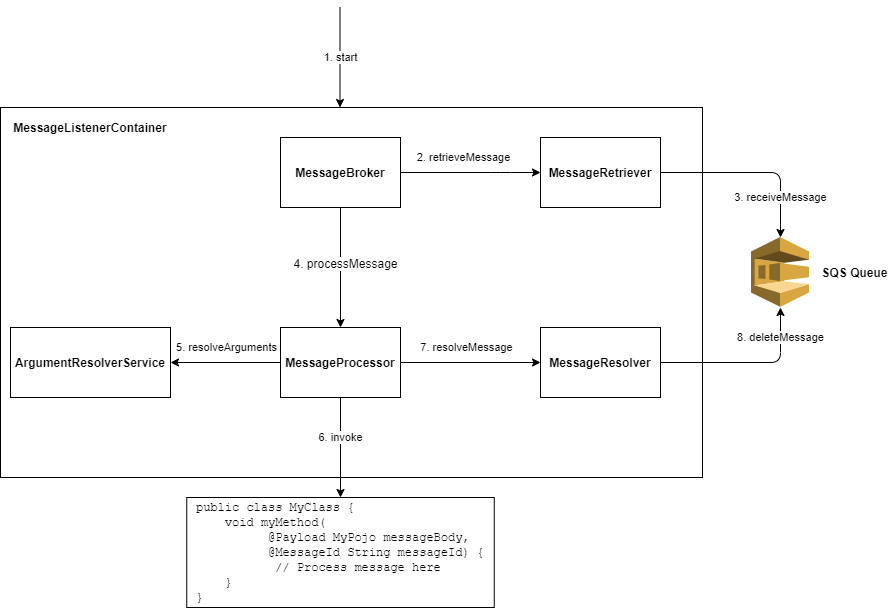

# Core Implementations
This document provides a quick overview of the core implementations of the API that can be used. Note that consumer can define their own implementations and
are not required to use these core implementations.

## Architecture
The following is the diagram for how a single message would be processed through the library.

### Message Retriever
The [MessageRetriever](../java-dynamic-sqs-listener-api/src/main/java/com/jashmore/sqs/retriever) has a simple API in that it only exposes methods to obtain
a message from the queue and it makes no requirements on how it should get these messages from the SQS queue. This allows for ability to optimise the
retrieval of messages such as batching requests for retrieving messages or pre-fetching messages. Note that the must be thread safe as there could be
multiple threads all requesting for messages to process.

Core implementations include:
- [IndividualMessageRetriever](../java-dynamic-sqs-listener-core/src/main/java/com/jashmore/sqs/retriever/individual/IndividualMessageRetriever.java):
This will request a single message from the queue every time a consumer needs it. This is the least optimal but simplest solution and would most likely
only be useful for local development or with a queue that has infrequent messages.
- [PrefetchingMessageRetriever](../java-dynamic-sqs-listener-core/src/main/java/com/jashmore/sqs/retriever/prefetch/PrefetchingMessageRetriever.java):
This will prefetch messages from the queue so that consumers can have a message straight away. This can reduce the time to get a message and therefore
increase performance. This implementation is not appropriate if the prefetched messages visibility timeout expires because the messages take a long time
to be processed, resulting in the message being placed back into the queue (if there is a redrive policy).  This implementation is more appropriate for high
volumes of messages that take little time to process.
- [BatchingMessageRetriever](../java-dynamic-sqs-listener-core/src/main/java/com/jashmore/sqs/retriever/batching/BatchingMessageRetriever.java):
This will batch requests for messages from the consumer into a single call out to the SQS queue once a certain threshold of threads are requesting
messages or at a given period if the threshold is not reached. This reduces the number of calls out to the SQS queue but reduces the performance
as threads are just waiting until other threads also request messages.

### Message Processor
The [MessageProcessor](../java-dynamic-sqs-listener-api/src/main/java/com/jashmore/sqs/processor/MessageProcessor.java)
has the responsibility of processing the message that has been retrieved by the[MessageRetriever](../java-dynamic-sqs-listener-api/src/main/java/com/jashmore/sqs/retriever)
by calling the corresponding Java method that processes the message.  This should resolve any arguments for the method by calling to the
[ArgumentResolverService](../java-dynamic-sqs-listener-api/src/main/java/com/jashmore/sqs/argument/ArgumentResolverService.java) and using the resulting
values as the method arguments.

Core implementations include:
- [DefaultMessageProcessor](../java-dynamic-sqs-listener-core/src/main/java/com/jashmore/sqs/processor/DefaultMessageProcessor.java):
default implementation that calls out to a `ArgumentResolverService` to resolve the arguments and calls the method.
- [RetryableMessageProcessor](../java-dynamic-sqs-listener-core/src/main/java/com/jashmore/sqs/processor/retryable/RetryableMessageProcessor.java)
implementation that will retry if there was a failure to process the message (an exception was thrown). This is useful if there is no redrive policy
on the queue and it is desirable to just try again after a certain delay.

### ArgumentResolverService
The [ArgumentResolverService](../java-dynamic-sqs-listener-api/src/main/java/com/jashmore/sqs/argument/ArgumentResolverService.java) is used to populate
the parameters of a method being executed by the MessageProcessor with details about the message. For example, a parameter with the
[@Payload](../java-dynamic-sqs-listener-core/src/main/java/com/jashmore/sqs/argument/payload/Payload.java) annotation will be resolved with the body
of the message cast to that type.

The implementations of the `ArgumentResolverService` include:
- [DelegatingArgumentResolverService](../java-dynamic-sqs-listener-core/src/main/java/com/jashmore/sqs/argument/DelegatingArgumentResolverService.java):
this implementation delegates to specific [ArgumentResolver](../java-dynamic-sqs-listener-api/src/main/java/com/jashmore/sqs/argument/ArgumentResolver.java)s
that have the responsibility of handling an individual type of argument resolution. See below for the core
[ArgumentResolver](../java-dynamic-sqs-listener-api/src/main/java/com/jashmore/sqs/argument/ArgumentResolver.java)s available.
- [CoreArgumentResolverService](../java-dynamic-sqs-listener-core/src/main/java/com/jashmore/sqs/argument/CoreArgumentResolverService.java): this is
a helper implementation that uses the DelegatingArgumentResolverService under the hood with all of the core
[ArgumentResolver](../java-dynamic-sqs-listener-api/src/main/java/com/jashmore/sqs/argument/ArgumentResolver.java)s.

The core arguments that be resolved include:
- [@Payload](../java-dynamic-sqs-listener-core/src/main/java/com/jashmore/sqs/argument/payload/Payload.java): arguments annotated with this will parse the
message body into that object. If this is a String a direct transfer of the message contents is passed in, otherwise if it is a Java Bean, an attempt to
cast the message body to that bean will be used. This is provided by the
[PayloadArgumentResolver](../java-dynamic-sqs-listener-core/src/main/java/com/jashmore/sqs/argument/payload/PayloadArgumentResolver.java), which uses
a [PayloadMapper](../java-dynamic-sqs-listener-core/src/main/java/com/jashmore/sqs/argument/payload/mapper/PayloadMapper.java), such as
the [JacksonPayloadMapper](../java-dynamic-sqs-listener-core/src/main/java/com/jashmore/sqs/argument/payload/mapper/JacksonPayloadMapper.java)
that uses a Jackson `ObjectMapper` to parse the message body.
- [@MessageId](../java-dynamic-sqs-listener-core/src/main/java/com/jashmore/sqs/argument/messageid/MessageId.java): String arguments annotated with this will
place the message ID of the message into this argument. This is provided by the
[MessageIdArgumentResolver](../java-dynamic-sqs-listener-core/src/main/java/com/jashmore/sqs/argument/messageid/MessageIdArgumentResolver.java).
- [Acknowledge](../java-dynamic-sqs-listener-api/src/main/java/com/jashmore/sqs/processor/argument/Acknowledge.java): arguments of this type will be injected
with an implementation that allows for a message to be manually acknowledged when it is successfully processed. Note that if this is included in the messages
signature, the [MessageProcessor](../java-dynamic-sqs-listener-api/src/main/java/com/jashmore/sqs/processor/MessageProcessor.java) is not required to
acknowledge the message after a successful execution. These implementations should be provided by the
[MessageProcessor](../java-dynamic-sqs-listener-api/src/main/java/com/jashmore/sqs/processor/MessageProcessor.java) being used.
- [VisibilityExtender](../java-dynamic-sqs-listener-core/src/main/java/com/jashmore/sqs/argument/visibility/VisibilityExtender.java): arguments of this type
will be injected with an implementation that extends the message visibility of the current message. This is provided by the
[VisibilityExtenderArgumentResolver](../java-dynamic-sqs-listener-core/src/main/java/com/jashmore/sqs/argument/visibility/VisibilityExtenderArgumentResolver.java). 

### Message Broker
The [MessageBroker](../java-dynamic-sqs-listener-api/src/main/java/com/jashmore/sqs/broker) is the main container that controls the whole flow
of messages from the [MessageRetriever](../java-dynamic-sqs-listener-api/src/main/java/com/jashmore/sqs/retriever) to the
[MessageProcessor](../java-dynamic-sqs-listener-api/src/main/java/com/jashmore/sqs/processor/MessageProcessor.java). It can provide logic like the rate
of concurrency of the messages being processed or when messages should be processed.

Core implementation include:
- [SingleThreadedMessageBroker](../java-dynamic-sqs-listener-core/src/main/java/com/jashmore/sqs/broker/singlethread/SingleThreadedMessageBroker.java):
this implementation only runs on a single thread and therefore only a single message can be processed at once. This would most often just be useful
for local development and testing and does not have a significant production use case.
- [ConcurrentMessageBroker](../java-dynamic-sqs-listener-core/src/main/java/com/jashmore/sqs/broker/concurrent/ConcurrentMessageBroker.java): this
implementation will run on multiple threads each processing messages. It has dynamic configuration and this allows the rate of concurrency to change
dynamically while the application is running.