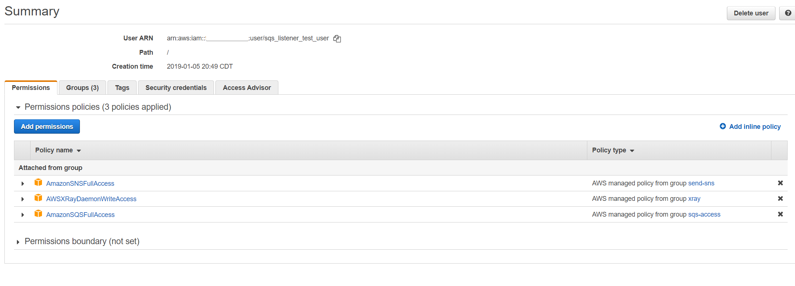
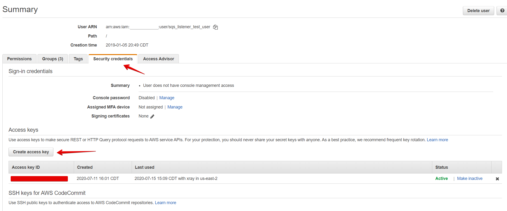
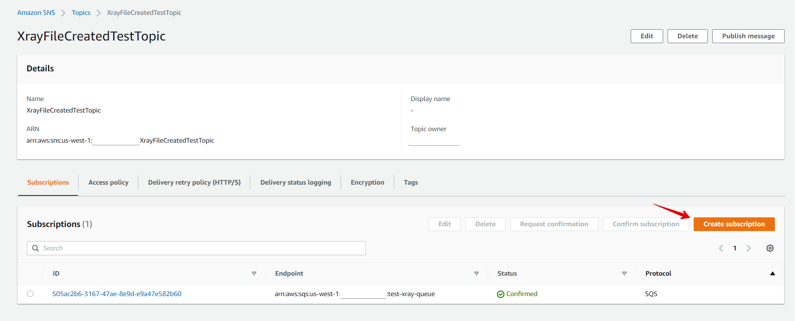

# AWS XRay Spring Example

This shows an example of integrating into AWS XRay Tracing using a local XRay Daemon and AWS resources such as SQS and SNS.

## Steps

1. Create an IAM User with Access to write to SNS, SQS and Xray. For example, in this IAM user have given full permissions to each of these resource types.

    

1. Obtain an Access Key and Secret Key for this user.

    

1. Create a SQS queue with default settings. Copy the Queue URL and put it in the `sqs.queue.url` [application.yml](src/main/resources/application.yml)
property.
1. Create a new SNS Topic in the same region as the SQS queue and place the SNS ARN in the `sns.arn` [application.yml](src/main/resources/application.yml)
property.
1. Create a subscription from the SNS Topic to SQS, this will mean any messages added to the SNS topic will create a message in the SQS Queue.

    

1. Run a local XRay Daemon by following this [guide](https://docs.aws.amazon.com/xray/latest/devguide/xray-daemon-local.html), making sure you give it access
via the access key and secret key obtained above. For example by placing it in your ~/.aws/credentials file like:

    ```text
    [default]
    aws_access_key_id = {keyHere}
    aws_secret_access_key = {secretHere}
    ```

1. Run the application replacing the variables with your access keys

    ```bash
    AWS_ACCESS_KEY_ID={keyHere} AWS_SECRET_ACCESS_KEY={secretHere} AWS_REGION={sqsRegionHere} gradle bootRun
    ```

1. You should now see messages processing logs for messages directly sent to SQS or via SNS, as well as placing traces into Xray
